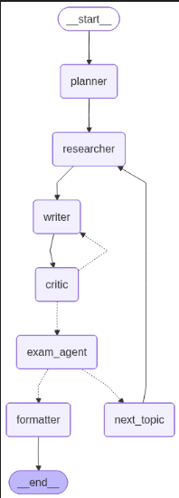

# 🚀 NoteForge-AI  
### Multi-Agent AI System for Generating Exam-Ready Notes

> Transform any syllabus into **structured, high-quality notes + important questions** using autonomous AI agents.

---

## 📌 Overview

**NoteForge-AI** is a multi-agent AI system that automates the entire note-generation pipeline:

- Converts raw syllabus into structured topics  
- Extracts knowledge from PDFs or the web (RAG)  
- Generates clean, exam-focused notes  
- Produces unit-wise important questions  
- Exports everything into a formatted PDF  

This system mimics how a **top student prepares notes**, but does it autonomously using LLM agents.

---

## 🎯 Key Capabilities

- 🧠 **Multi-Agent Workflow** (Planner → Researcher → Writer → Critic → Exam Generator)  
- 📚 **Hybrid Knowledge Retrieval**
  - PDF-based RAG (primary)
  - Web fallback via Tavily  
- 🔁 **Self-Improving Output** using critic feedback loop  
- 📝 **Exam-Oriented Content Generation**  
- 📄 **Automated PDF Export**  
- ⚡ **Caching Layer** for performance optimization  

---

## 🧠 System Architecture



> Built using a modular **LangGraph agent pipeline** with iterative refinement loops.

---

## 🔄 Execution Pipeline

| Stage | Agent | Responsibility |
|------|------|----------------|
| 1 | Planner | Break syllabus into structured topics |
| 2 | Researcher | Retrieve relevant content (PDF/Web) |
| 3 | Writer | Generate structured notes |
| 4 | Critic | Evaluate & refine output (iterative loop) |
| 5 | Exam Agent | Generate important questions |
| 6 | Aggregator | Combine all topics |
| 7 | Formatter | Generate final PDF |

---

## 🧰 Tech Stack

| Layer | Tools |
|------|------|
| Orchestration | LangGraph |
| LLM Framework | LangChain |
| Inference | Groq |
| Retrieval | FAISS |
| Embeddings | Sentence Transformers |
| PDF Processing | PyMuPDF |
| Web Search | Tavily |
| Frontend | Streamlit |
| Output | FPDF |

---

## ⚙️ Installation

```bash
git clone https://github.com/Lingesh-7/noteforge-ai.git
cd noteforge-ai
pip install -r requirements.txt
```
## 🔐 Environment Setup
Create a .env file in the root directory:
```
GROQ_API_KEY=your_api_key
TAVILY_API_KEY=your_api_key
```
## ▶️ Usage
Run the application:
```streamlit run app.py ```


## 📁 Project Structure

├── app.py
├── graph/
│   ├── nodes.py
│   ├── graph_builder.py
│   └── state.py
├── prompts/
├── rag/
├── utils/
├── fonts/
├── requirements.txt
└── README.md
